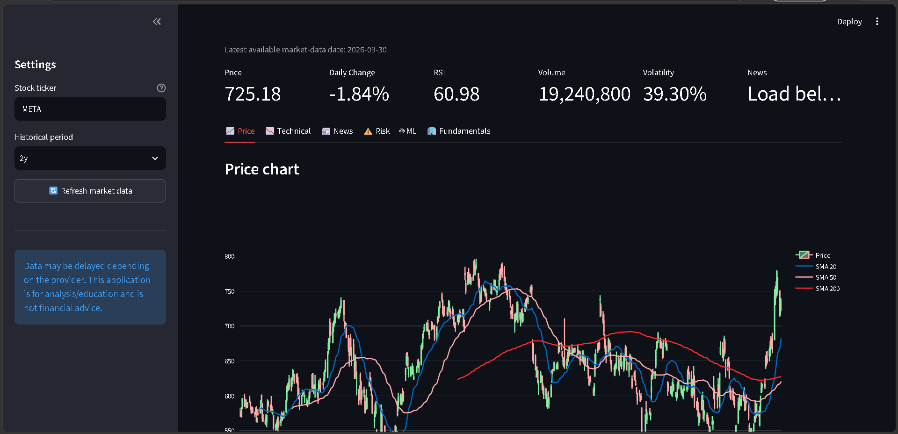
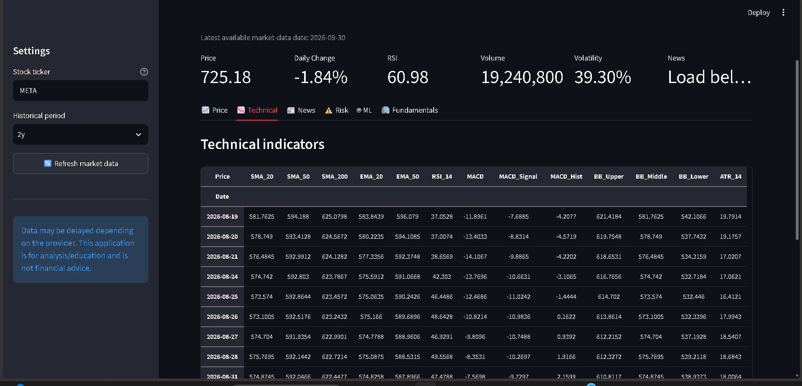
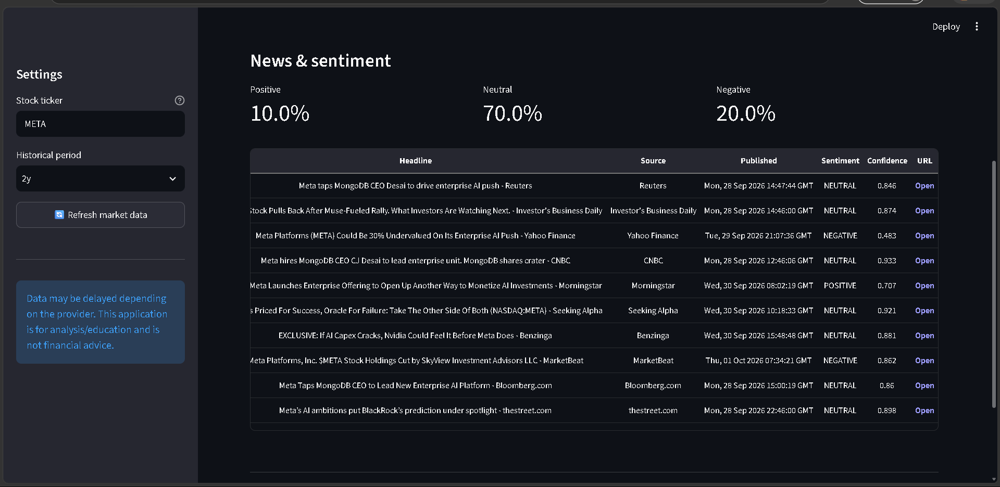
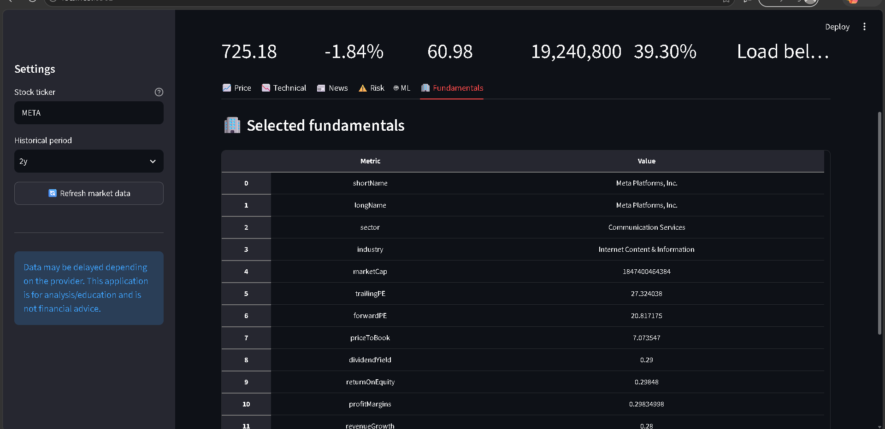

# 📈 AI Daily Stock Market Analysis Bot
## Dashboard Preview

## Screenshots

### Dashboard



### Technical Analysis



### News & Sentiment



### Fundamentals



An AI-powered stock market analysis dashboard built with **Python, Streamlit, Machine Learning, Technical Analysis, Risk Analysis, and Financial News Sentiment Analysis**.

The application collects historical market data, calculates technical indicators, analyzes risk, retrieves financial news, performs sentiment analysis using FinBERT, and uses a Random Forest classifier to classify the next observed market direction as **UP or DOWN**.

> ⚠️ This project is for educational and research purposes only. It is not financial advice and does not guarantee future market performance.

---

## 🚀 Features

### 📊 Market Data

- Historical stock price data
- Open, High, Low, Close and Volume
- Supports US and Indian stock tickers
- Examples:
  - `AAPL`
  - `MSFT`
  - `RELIANCE.NS`
  - `TCS.NS`
  - `INFY.NS`

Market data is retrieved using **Yahoo Finance through `yfinance`**.

---

## 📉 Technical Analysis

The application calculates several commonly used technical indicators:

- SMA 20
- SMA 50
- SMA 200
- EMA 20
- EMA 50
- RSI 14
- MACD
- MACD Signal
- MACD Histogram
- Bollinger Bands
- ATR
- Volume SMA
- Volume Change
- Daily Return

The dashboard also provides:

- Recent support
- Recent resistance
- Long-term trend interpretation
- Momentum interpretation
- MACD interpretation

---

## 📰 Financial News & Sentiment Analysis

The application retrieves recent financial news and analyzes the sentiment of headlines.

Sentiment categories:

- 🟢 Positive
- ⚪ Neutral
- 🔴 Negative

The sentiment model uses:

**ProsusAI/FinBERT**

The dashboard displays:

- Headline
- Source
- Published date
- Sentiment
- Confidence
- News URL

---

## ⚠️ Risk Analysis

Historical risk metrics include:

- Annualized volatility
- Average daily return
- Maximum drawdown
- Sharpe ratio
- Recent annualized volatility
- Beta

These metrics describe historical behavior and should not be interpreted as guaranteed future performance.

---

## 🤖 Machine Learning

The project includes a **Random Forest classification model**.

### Prediction Target

The model attempts to classify whether the next observed closing price is:

```text
UP